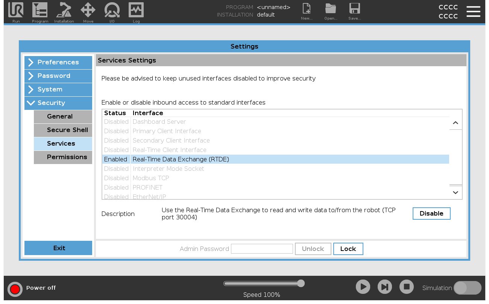
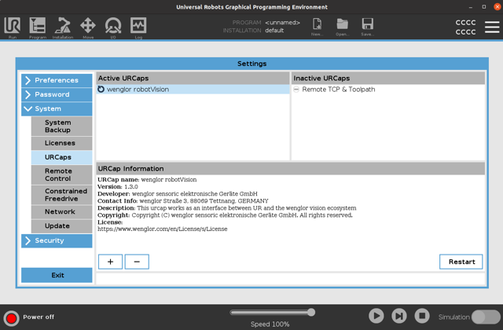

# 1. Installation of URCap

The **wenglor robot vision** URCap adds installation and program nodes to Polyscope 5 that connect the robot to a wenglor Machine Vision Device, calibrate the camera to the robot, and detect objects.

## Prerequisites

| Requirement | Value |
| --- | --- |
| Robot series | UR E-series (CB-series is **not** supported) |
| Polyscope version | 5.22 or newer |
| RTDE | Real Time Data Exchange must be enabled in the UR security settings |
| Network | Robot and Machine Vision Device in the same network |

## Download the URCap

Get the latest URCap version from this repository's own [`sources`](https://github.com/wenglor/robot-vision-ur-polyscope5/tree/main/sources) directory, and copy the URCap file onto a **freshly formatted** USB stick.

## Install on the UR Teach Panel

1. Plug the USB stick into the UR Teach Panel.
2. Start the robot and open the menu in the **top right corner** of the UR Teach Panel.

<figure class="align-left">

</figure>

1. Navigate to the **System** menu and select **URCaps**.
2. Click the **+** symbol.

<figure class="align-left">

</figure>

1. Navigate through the file system until you find the URCap file **"wenglor robot vision"**. Select it.
2. Proceed by **restarting the robot**.

After the reboot, the URCap is displayed with a **green hook**, indicating a successful installation.

<figure class="align-left">

</figure>

!!! note

    On the Machine Vision Device website (tab `Jobs` → `Robot Server`), make sure the robot server is active and the robot manufacturer is set to **UR Polyscope 5 URCap**. See [Settings on Device Website](https://wenglor.github.io/robot-vision-generic-string/4_3_0_settings_on_device_website/) in the wenglor robot vision manual.

Once the URCap is installed, continue with [User Configuration](2_0_0_user_configuration.md) to configure the connection and run the calibration.
