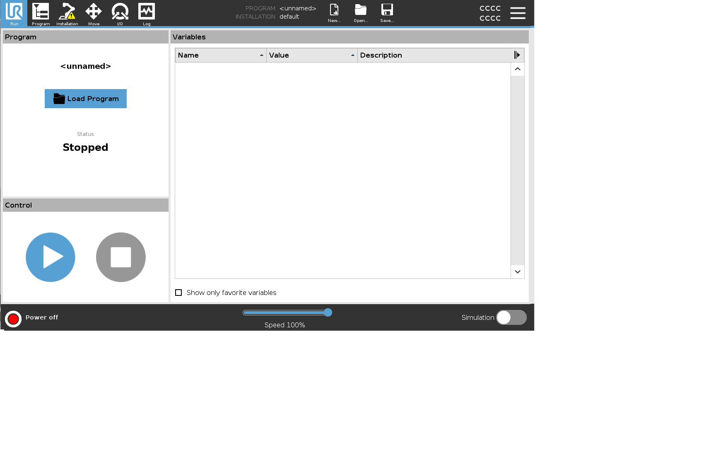
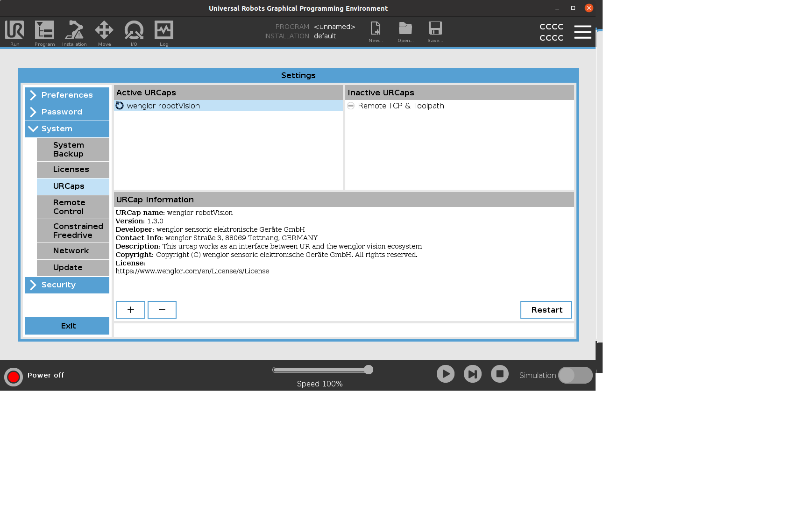
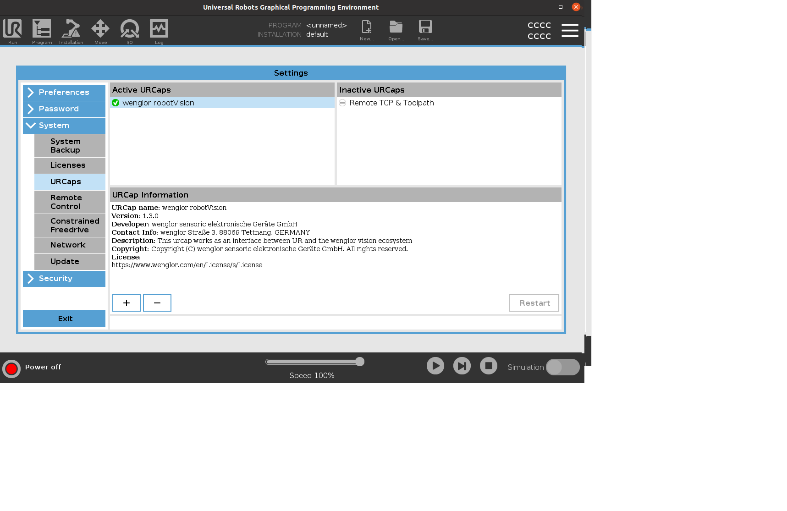

# Installation of URCap

The **wenglor robot vision** URCap adds installation and program nodes to Polyscope 5 that connect the robot to a wenglor Machine Vision Device, calibrate the camera to the robot, and detect objects.

## Prerequisites

| Requirement | Value |
| --- | --- |
| Robot series | UR E-series (CB-series is **not** supported) |
| Polyscope version | 5.22 or newer |
| RTDE | Real Time Data Exchange must be enabled in the UR security settings |
| Network | Robot and Machine Vision Device in the same network |

## Download the URCap

Download the latest URCap version from [www.wenglor.com/product/DNNF023](https://www.wenglor.com/product/DNNF023) → Downloads → Programming examples and configuration files → Examples_Robot_Vision, and copy the URCap file onto a **freshly formatted** USB stick.

## Install on the UR Teach Panel

1. Plug the USB stick into the UR Teach Panel.
2. Start the robot and open the menu in the **top right corner** of the UR Teach Panel.

<!-- PLACEHOLDER IMAGE: UR Teach Panel top-right menu -->

3. Navigate to the **System** menu and select **URCaps**.
4. Click the **+** symbol.

<!-- PLACEHOLDER IMAGE: System -> URCaps with the + symbol -->

5. Navigate through the file system until you find the URCap file **"wenglor robot vision"**. Select it.
6. Proceed by **restarting the robot**.

After the reboot, the URCap is displayed with a **green hook**, indicating a successful installation.

<!-- PLACEHOLDER IMAGE: Installed URCap with green hook -->

!!! note

    On the Machine Vision Device website (tab `Jobs` → `Robot Server`), make sure the robot server is active and the robot manufacturer is set to **UR Polyscope 5 URCap**. See [Settings on Device Website](https://wenglor.github.io/robot-vision-generic-string/4_0_robot_vision_server/4_2_0_settings_on_device_website/) in the wenglor robot vision manual.

Once the URCap is installed, continue with [User Configuration](../2_0_user_configuration/index.md) to configure the connection and run the calibration.
