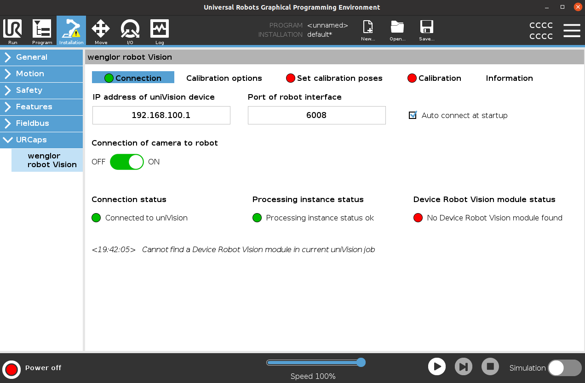
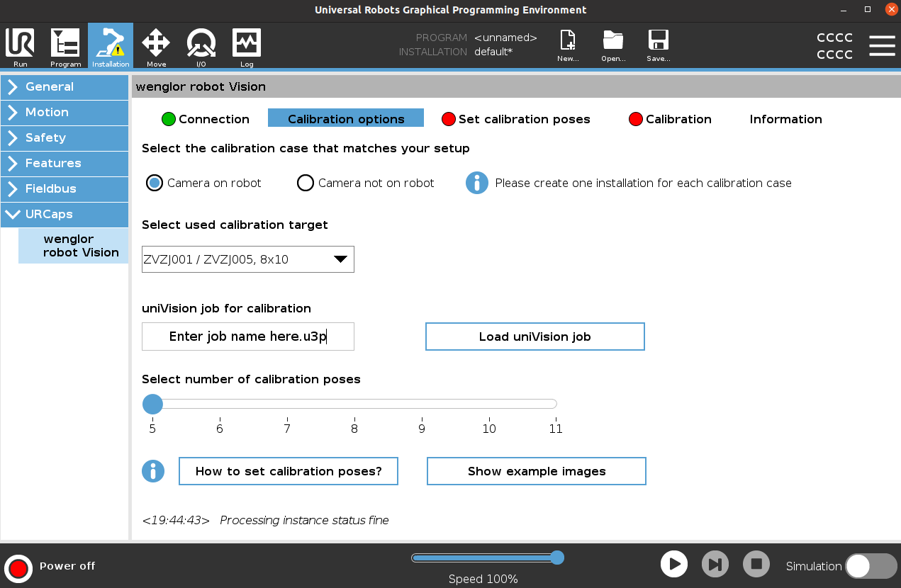
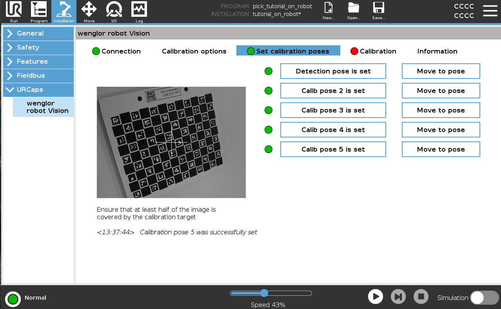
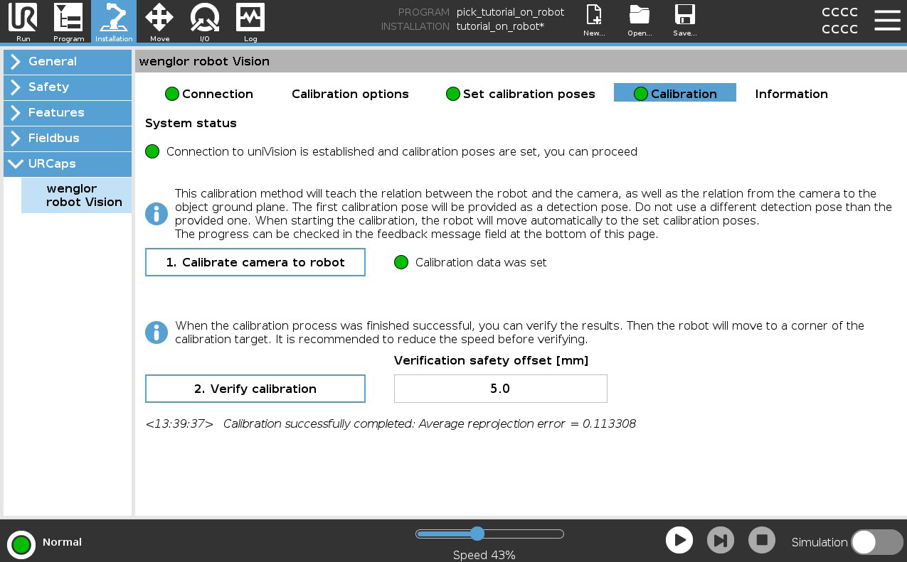
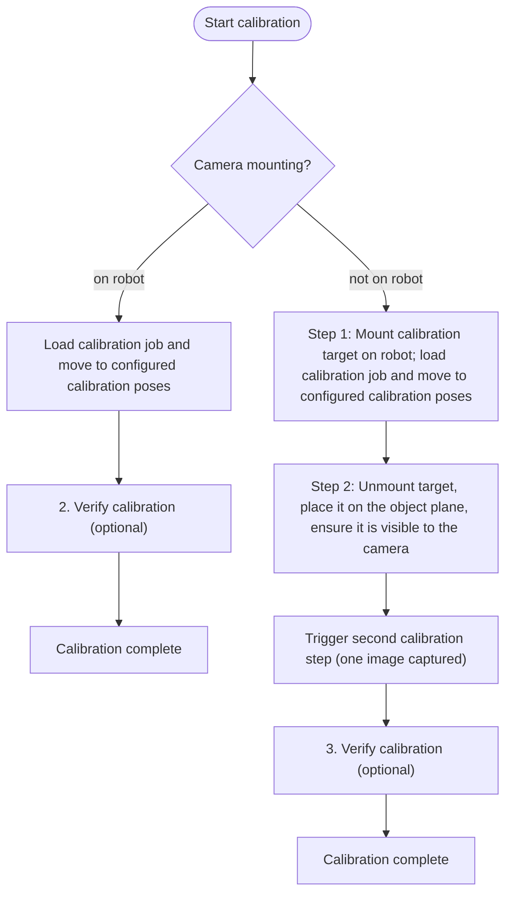
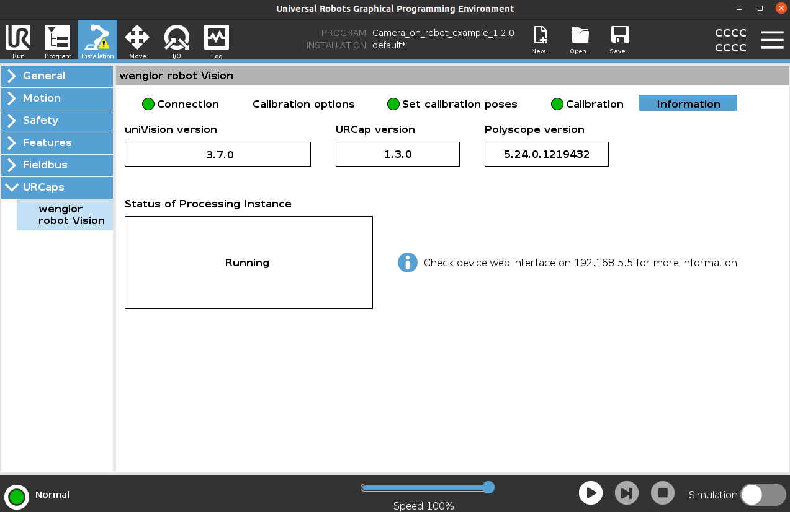

# 2. User Configuration

The installation part of the URCap lets you connect to the Machine Vision Device and calibrate the camera to the robot. On the UR Teach Panel, select **Installation** and click **URCaps → "wenglor robot vision"**.

The installation is organized into tabs: **Connection**, **Calibration options**, **Set calibration poses**, **Calibration**, and **Information**.

## Tab LED status overview

Each tab carries a status LED so you can see the overall state at a glance:

| Tab | LED | Meaning |
| --- | --- | --- |
| **Connection** | 🔴 Red | No connection to the Machine Vision Device possible. Check the network setup. |
| | 🟢 Green | Connection to the Machine Vision Device established and valid. |
| **Set calibration poses** | 🔴 Red | Not all calibration poses were set. Check and set them accordingly. |
| | 🟢 Green | All calibration poses were set. |
| **Calibration** | ⚪ Grey | Could not check for previous calibration data — no connection to the device. Establish the connection first. |
| | 🔴 Red | No valid calibration data available. Run the calibration procedure again. |
| | 🟡 Yellow | Calibration is incomplete (e.g. the second calibration step is missing when the camera is not on the robot). |
| | 🟢 Green | Calibration data was set during the current session or loaded from a previous calibration. |

## Connection tab

Connect to the Machine Vision Device by entering the **IP address** (default `192.168.100.1`) and the **port** (default `6008`), then setting the connection slider to **on**. By default, **auto connect at startup** is active.

<figure class="align-left">

</figure>

!!! note

    Make sure the robot and the Machine Vision Device are in the same network.

The connection tab shows three status indicators:

| Status | 🔴 Red | 🟢 Green |
| --- | --- | --- |
| **Connection status** | No connection possible. Check the cables and network setup. | Connection to the Machine Vision Device is available. |
| **Processing Instance status** | The Processing Instance reports an error. Check its status on the device website. | No error at the Processing Instance. |
| **Device Robot Vision module status** | No `Device Robot Vision` in the current uniVision job. Add it to the job. | `Device Robot Vision` is available in the current uniVision job. |

## Calibration options tab

Select whether the camera is **mounted on the robot** or **not on the robot**, and choose the size of the **ZVZJ calibration target**. This is the same target selection used by the **Detect target** and **Calibrate to target** program nodes — their "target index" selects among the target sizes configured here, not a separate per-job target list (see [UR Program](3_0_0_robot_program.md)).

Enter the name of the uniVision job for calibration and load it — this job is loaded every time the calibration procedure is started. Set the number of calibration poses between **5 and 11** (default: 5). More poses generally improve the calibration result (e.g. seven to eleven poses).

The tab also provides further information about how to set the calibration poses, including example images from the camera's perspective for the **Set calibration poses** tab.

<figure class="align-left">

</figure>

## Set calibration poses tab

The calibration poses differ between **camera on robot** and **camera not on robot**. The number of buttons for setting the poses depends on the pose count chosen in the calibration options tab.

<figure class="align-left">

</figure>

!!! note

    - For details about how to choose and vary the calibration poses, see the [Wenglor Robot Server overview](https://wenglor.github.io/robot-vision-generic-string/4_0_robot_vision_server/) in the wenglor robot vision manual — they are not repeated here.
    - For **camera on robot**, keep in mind that the **first calibration pose is also the detection pose** used later.

## Calibration tab

The calibration tab has a **system status LED** that combines the connection state and the calibration-pose state:

| LED | Meaning |
| --- | --- |
| 🔴 Red | No active connection to the device **and** not all calibration poses set. Connect and set the poses. |
| 🟡 Yellow | Only one condition is met — either connected but poses not all set, or poses set but not connected. |
| 🟢 Green | Active connection **and** all calibration poses set. |

Calibration can only be started when the system status LED is **green**. When it starts, the *uniVision job for calibration* is loaded. Each successful calibration creates a separate calibration file with an ascending number on the Machine Vision Device at `/media/card/calibration`. By default the latest calibration file is used; another file can be loaded on the device website under the **Jobs** tab.

!!! note

    For **camera not on robot**, the robot-to-camera calibration (step 1) and the camera-to-ground calibration (step 2) are tracked as separate calibration states internally. If only one of them has valid data, the tab reports which one is missing so you know which step to repeat.

<figure class="align-left">

</figure>

### Camera on robot

Only **one calibration step** is required. When the calibration starts, the robot loads the calibration job and automatically moves to the calibration poses set in the **Set calibration poses** tab.

### Camera not on robot

The calibration requires **two steps**:

1. **First step:** Mount the calibration target on the robot. The robot loads the calibration job and automatically moves to the configured calibration poses.
2. **Second step:** Unmount the calibration target from its holder and place it on the object plane. Make sure the target is visible to the camera (move the robot arm away so it does not interfere) — check the camera image in the **Set calibration poses** tab. When the target is placed, trigger the second calibration step. Only **one image** is captured for this step.

!!! note

    Calculating the calibration results takes some time — wait until the calibration is completed.

### Verify calibration

After calibration data is loaded (either just calculated or loaded from a previous file), an additional **verify calibration** step is available — step 2 for camera on robot, step 3 for camera not on robot:

1. Set the **Verification safety offset [mm]** — the robot is guided to a pose this many centimeters **above** the calibration target, rather than directly onto it, as a collision margin.
2. Click **Start guidance** to confirm ("You are about to verify loaded calibration results, do you want to proceed?") and move the robot above the calibration target using the current calibration result. Cancel if the target has been moved since calibrating.
3. Visually check that the robot is positioned correctly above the target. If not, the calibration data may be corrupt — recalibrate.

!!! note

    For **camera not on robot**, the robot-to-camera and camera-to-ground calibrations are tracked and can be verified independently. If one of them is missing, the URCap reports it (e.g. "No robot to camera calibration data found, perform those calibrations first") instead of starting the guidance move.

    If a previous calibration attempt failed, the URCap warns that the calibration data may be corrupt and that verification is not safe before you proceed.

## Information tab

The information tab contains details about the different versions as well as the status of the Processing Instance.

<figure class="align-left">

</figure>

Once the calibration is complete, continue with the [UR Program](3_0_0_robot_program.md).
