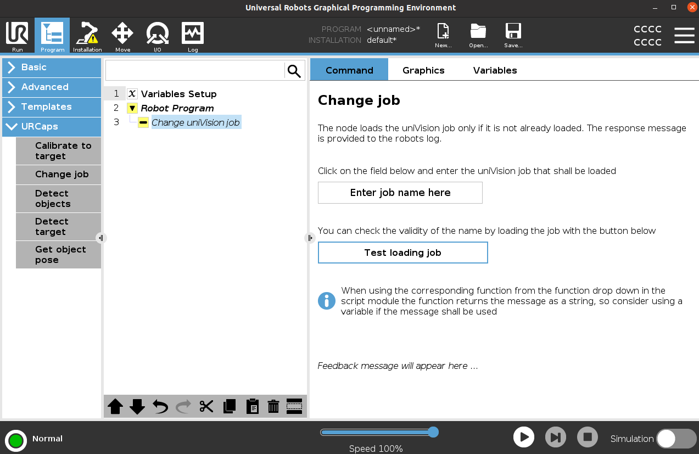
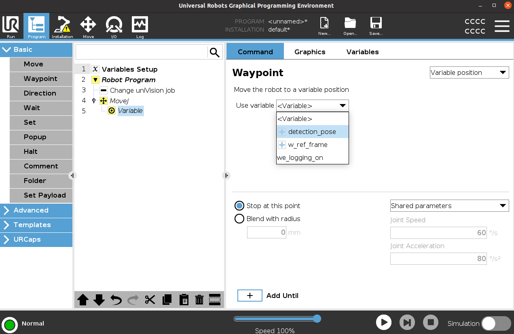
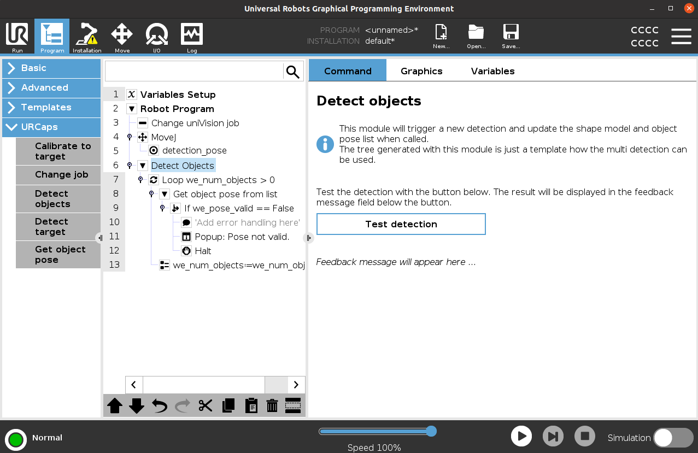
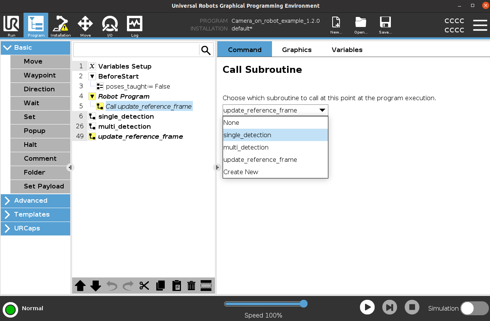
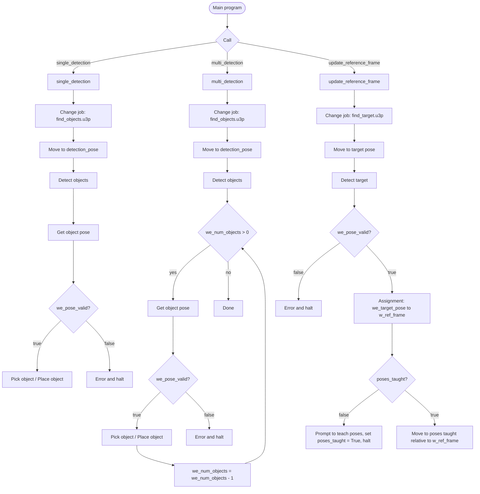

# 3. Robot Program

The **wenglor robot vision** URCap adds program nodes to change the uniVision job, detect objects, get the object pose, detect the calibration target, and recalibrate to the target.

Switch to the **Program** tab on the UR side to build the robot program. The program nodes appear in the **URCaps** section of the left-hand drop-down menu.

## Program nodes

| Node | Purpose |
| --- | --- |
| **Change job** | Loads the uniVision job on the Processing Instance (e.g. `find_objects.u3p` for detection, `find_target.u3p` for the calibration target). |
| **Detect objects** | Triggers a detection and fills the robot-server buffer. Writes the number of found objects into `we_num_objects`. Acts as a parent node for **Get object pose**. |
| **Get object pose** | Reads one object from the buffer: the 3D pose into `we_object_pose`, the shape model ID into `we_shape_model`, the additional value into `we_custom_value`, and a validity flag into `we_pose_valid`. |
| **Detect target** | Detects the calibration target and writes its pose into `we_target_pose` (plus `we_custom_value` and `we_pose_valid`). |
| **Calibrate to target** | Recalibrates the camera-to-ground relation against the calibration target, without creating a new calibration file (the result is only cached). |

For the full node and variable reference and the unit conventions, see [Node reference](#node-reference) below.

## Program variables

The examples use these program variables (prefix `we_`), initialized in the **Init Variables** section:

/// html | div.col-widths
    attrs: {style: "--w1: 30%; --w2: 15%; --w3: 55%;"}

| Variable | Type | Meaning |
| --- | --- | --- |
| `we_object_pose` | pose | The 3D object pose returned by **Get object pose**. |
| `we_target_pose` | pose | The calibration target pose returned by **Detect target**. |
| `we_num_objects` | integer | Number of found objects (set by **Detect objects**). |
| `we_shape_model` | integer | Shape model ID of the current object. |
| `we_custom_value` | string | An additional value linked in uniVision (e.g. the detection score). |
| `we_pose_valid` | boolean | Whether the returned pose is valid — check this before moving. |
| `we_logging_on` | boolean | If `True`, the wenglor nodes write messages to the robot log. |
///

`poses_taught` (boolean, in the **Before Start** section) is used by the reference-frame update flow — see [`update_reference_frame`](#update_reference_frame).

## Load the detection job

Add the **Change job** node and enter the name of the uniVision job file (e.g. `find_objects.u3p`). To test the validity of the job name, load it with the **Test loading job** button.

<figure class="align-left">

</figure>

## Detection pose

- **Camera not on robot:** Teach a fixed `detection_pose` waypoint to keep the robot out of the camera's field of view while it captures images.
- **Camera on robot:** Move the robot to the detection pose so that the camera can check for objects. This detection pose **must be the one from the URCap** (identical to the first calibration pose), and is used as the `detection_pose` **feature**. To update it, set the detection pose on the URCap installation page and **re-run the calibration process**.

<figure class="align-left">

</figure>

## Detect objects

Add the **Detect objects** node. It triggers a detection and sets `we_num_objects`. Place a **Get object pose** node inside it to read an object from the buffer. Each **Get object pose** sets `we_object_pose`, `we_shape_model`, `we_custom_value`, and `we_pose_valid`.

Always check `we_pose_valid` before using the pose — the examples pop up an error and halt if it is `False`. You can add conditional checks on `we_shape_model` or `we_custom_value` to branch per object type.

<figure class="align-left">

</figure>

## Example programs

Two example programs are provided — one per calibration case:

- `Camera_on_robot_example` — the detection pose is a **variable** waypoint using the URCap `detection_pose` feature.
- `Camera_not_on_robot_example` — the detection pose is a **fixed** waypoint you teach so the robot does not cover the target.

Both programs contain the same three subprograms, called with the **Call** command:

- `single_detection`
- `multi_detection`
- `update_reference_frame`

<figure class="align-left">

</figure>

### `single_detection`

Changes to the detection job (`find_objects.u3p`), moves to the detection pose, runs **Detect objects**, and reads one object with **Get object pose**. After validating `we_pose_valid`, it moves to the object at reduced speed, then provides placeholder `Pick object` / `Place object` folders for your gripping and placing logic.

### `multi_detection`

Like `single_detection`, but wraps **Get object pose** in a **`while we_num_objects > 0`** loop to handle multiple objects from a single detection. At the end of each iteration, the program assigns `we_num_objects = we_num_objects - 1` to advance through the buffer and prevent index errors.

### `update_reference_frame`

Run from the **Main** program. It shows how the calibration target pose can update a reference frame — and, with it, all related poses (see the [Wenglor Robot Server overview](https://wenglor.github.io/robot-vision-generic-string/5_1_0_basics_with_robot_server/) in the wenglor robot vision manual). A typical use case is a mobile platform correcting positional deviation in front of a machine or shelf.

The **Detect target** node is the URCap front end for the `target:pose` command described in [Target Pose and Camera-to-Target Calibration](https://wenglor.github.io/robot-vision-generic-string/5_5_0_target_pose_and_camera_to_target/) in the wenglor robot vision manual — that page also covers `calibration:target`, which this URCap exposes as its own **Calibrate to target** node (see below).

The example flow:

1. **Change job** to `find_target.u3p`, then move to a pose where the target is visible (and, for camera not on robot, not covered by the robot).
2. **Detect target** — writes the target pose into `we_target_pose` and sets `we_pose_valid`. If invalid, it pops up an error and halts.
3. An **Assignment** node assigns `we_target_pose` to the `w_ref_frame` **feature**. This permanently updates the installation feature, so the change survives a robot restart.
4. If `poses_taught == False`, the program shows a message asking you to teach the poses relative to `w_ref_frame`, set `poses_taught` to `True`, and restart — then halts.
5. On the next run (with `poses_taught == True`), the reference is updated and the robot moves to the poses taught relative to `w_ref_frame` (e.g. `pose_in_machine`).

!!! warning

    - `w_ref_frame` is saved in the **installation**, not in the program. **Save the installation before shutting down the robot**, otherwise the update is lost.
    - The program reads installation feature values only at program start, which is why the **Assignment** node is required to update `w_ref_frame` within the run so the same run can use the updated value.
    - When teaching your machine poses, select `w_ref_frame` as the **feature**.

### Calibrate to target

The **Calibrate to target** node recalibrates the camera-to-ground relation directly against the calibration target. Unlike the **Calibration** procedure on the installation page, it does **not** create a new numbered calibration file on the Machine Vision Device — the result is only cached and used for the rest of the session.

To use the node:

1. Place it in the program and select the same **calibration target** configured on the installation's **Calibration options** tab.
2. Move the robot to a pose where the target is visible before running the node.
3. Run the node. It requires an active connection to the Machine Vision Device (set up on the URCap installation page); otherwise it reports an error and does nothing.
4. On success, the node reports "Calibration to target successful".

Use **Test calibration** in the node's view to try the recalibration interactively while editing the program.

!!! note

    The example programs do not call **Calibrate to target** — add it to your own program if you need to recalibrate to the target at runtime (e.g. after a mobile platform docks) without going through the full installation **Calibration** procedure.

!!! note

    The example programs (`Camera_on_robot_example`, `Camera_not_on_robot_example`) and the URCap are available in this repository's [`sources`](https://github.com/wenglor/robot-vision-ur-polyscope5/tree/main/sources) directory.

## Node reference

Look-up reference for the **wenglor robot vision** URCap: the installation nodes that configure the connection and calibration, the program nodes you place in the robot program, and the unit conventions the URCap maps between the generic robot vision API and UR.

### Installation nodes (tabs)

Configured once under **Installation → URCaps → "wenglor robot vision"**. See [User Configuration](2_0_0_user_configuration.md) for details.

| Tab | Configures |
| --- | --- |
| **Connection** | IP address (default `192.168.100.1`), port (default `6008`), connection slider, auto connect at startup. |
| **Calibration options** | Camera on/not on robot, ZVZJ calibration target size, calibration job name, number of calibration poses (5–11). |
| **Set calibration poses** | The individual calibration poses; for camera on robot, the first pose is also the detection pose. |
| **Calibration** | Starts the calibration procedure; stores a numbered calibration file on the device. |
| **Information** | Version information and Processing Instance status. |

### Program nodes

Placed in the robot program from the **URCaps** section of the left-hand drop-down menu.

/// html | div.col-widths
    attrs: {style: "--w1: 36%; --w2: 28%; --w3: 36%;"}

| Node | Input | Output / effect |
| --- | --- | --- |
| **Change job** | uniVision job file name (`jobNameKey`) | Loads the given job on the Processing Instance. Use **Test loading job** to verify the name. |
| **Detect objects** | — | Triggers a detection and fills the robot-server buffer. Sets `we_num_objects`. Acts as parent for **Get object pose**. |
| **Get object pose** | (reads the next object from the buffer) | Sets `we_object_pose`, `we_shape_model`, `we_custom_value`, and `we_pose_valid`. |
| **Detect target** | target index (`targetSelectorDetectTargetIndexKey`, default `0`) | Detects the calibration target; sets `we_target_pose`, `we_custom_value`, and `we_pose_valid`. Front end for the `target:pose` command — see [Target Pose and Camera-to-Target Calibration](https://wenglor.github.io/robot-vision-generic-string/5_5_0_target_pose_and_camera_to_target/). |
| **Calibrate to target** | target index (`targetSelectorCalibrateTargetIndexKey`) | Recalibrates the camera-to-ground relation against the target; result is cached only (no new calibration file). Requires an active device connection. Front end for the `calibration:target` command — see [Target Pose and Camera-to-Target Calibration](https://wenglor.github.io/robot-vision-generic-string/5_5_0_target_pose_and_camera_to_target/). |
///

Updating the `w_ref_frame` reference frame is **not** a dedicated node: the example uses a standard **Assignment** node to assign `we_target_pose` (from **Detect target**) to the `w_ref_frame` installation feature.

!!! note

    The URCap nodes are a graphical front end for the generic string based robot vision API. For the underlying commands, return values, and error codes, see the [Generic Robot Vision API](https://wenglor.github.io/robot-vision-generic-string/5_6_0_generic_robot_vision_api/) in the wenglor robot vision manual.

### Program variables

Set by the URCap nodes and used in the example programs (prefix `we_`):

/// html | div.col-widths
    attrs: {style: "--w1: 25%; --w2: 10%; --w3: 30%; --w4: 35%;"}

| Variable | Type | Set by | Description |
| --- | --- | --- | --- |
| `we_object_pose` | pose | Get object pose | The 3D object pose. |
| `we_target_pose` | pose | Detect target | The calibration target pose. |
| `we_num_objects` | integer | Detect objects | Number of found objects in the buffer. |
| `we_shape_model` | integer | Get object pose | Shape model ID of the current object. |
| `we_custom_value` | string | Get object pose / Detect target | Additional value linked in uniVision (e.g. detection score). |
| `we_pose_valid` | boolean | Get object pose / Detect target | Validity flag — check before moving to the pose. |
| `we_logging_on` | boolean | Change job / Detect objects (input) | If `True`, the wenglor nodes write to the robot log. |
///

Features and other variables used by the examples:

/// html | div.col-widths
    attrs: {style: "--w1: 25%; --w2: 15%; --w3: 60%;"}

| Name | Kind | Description |
| --- | --- | --- |
| `w_ref_frame` | installation feature | Reference frame updated by assigning `we_target_pose`. Saved in the **installation**, not the program — save the installation before shutdown, and assign it in the program so the updated value is used in the same run. |
| `detection_pose` | feature | The detection pose. Camera on robot: variable waypoint from the URCap. Camera not on robot: a fixed taught waypoint. |
| `pose_in_machine` | waypoint | Example pose taught relative to `w_ref_frame` in `update_reference_frame`. |
| `poses_taught` | boolean | In the **Before Start** section. Set to `True` once the poses have been taught relative to the updated `w_ref_frame`. |
///

### Units and conventions

The generic robot vision API uses the following conventions, which the URCap maps to the UR representation:

- Positions `x, y, z` are exchanged in **meters** — the same unit UR uses for poses.
- Orientations `rx, ry, rz` are exchanged as a **rotation vector** (Rodrigues convention, in radians) — the same convention UR uses for its pose orientation.

Because UR poses already use meters and a rotation vector, the pose format matches the generic API directly. See the command tables in the [Generic Robot Vision API](https://wenglor.github.io/robot-vision-generic-string/5_6_0_generic_robot_vision_api/) in the wenglor robot vision manual.
