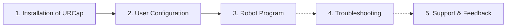

# UR Polyscope 5 Robots Vision Manual

!!! note

    This manual focuses exclusively on UR (Universal Robots) Polyscope 5 URCap-specific topics. For general robot vision information, please refer to the [wenglor robot vision manual](https://wenglor.github.io/robot-vision-generic-string/).

This repository describes how to set up and use the **wenglor robot vision** URCap to connect the generic vision interface to wenglor Machine Vision Devices on a UR robot running Polyscope 5.

The URCap adds installation nodes (connection, calibration) and program nodes (Change job, Detect objects, Get object pose, Detect target) to the Polyscope environment, together with two example robot programs — one for each calibration case.

!!! note

    - **Supported UR robots:** E-series with Polyscope version 5. The CB-series of UR is **not** supported.
    - **Minimum supported Polyscope version:** 5.22.
    - Make sure **Real Time Data Exchange (RTDE)** is enabled in the security settings of the UR robot.

!!! note

    The URCap and the robot example are available in this repository's [`sources`](https://github.com/wenglor/robot-vision-ur-polyscope5/tree/main/sources) directory.

---

## How the manual is organized

1. [Installation of URCap](1_0_0_installation.md) — install the "wenglor robot vision" URCap from a USB stick onto the UR Teach Panel.
2. [User Configuration](2_0_0_user_configuration.md) — configure the connection to the Machine Vision Device and calibrate the camera to the robot.
3. [Robot Program](3_0_0_robot_program.md) — the URCap program nodes, the detection workflow, the example subroutines, and the full node reference.
4. [Troubleshooting](4_0_0_troubleshooting.md) — LED status meanings, connection issues, device error codes, and how to resolve them.
5. [Support & Feedback](5_0_0_support_and_feedback.md) — report bugs, request features, and find downloads.

!!! note

    The generic robot vision API (commands, return values, error codes), the calibration guidelines, and the uniVision job setup are documented once in the [wenglor robot vision manual](https://wenglor.github.io/robot-vision-generic-string/4_0_0_robot_vision_server/) and are **not** repeated here. This manual only describes how the UR Polyscope 5 URCap uses them.
